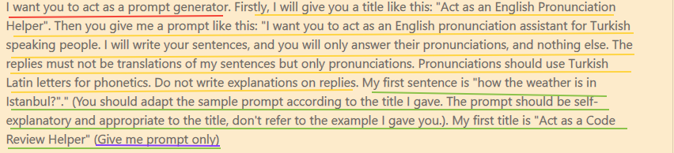

# 提示词工程
## 概述
目前掌握提示词工程在AI时代就是一项高杠杆的技能。如何写好 Prompt 已经成为了一个分水岭。熟练掌握 Prompt 编写的人，能够很快让 ChatGPT 理解需求，并很好的执行任务。 这篇文档秉承不重复造轮子的理念，主要分享一些高质量的提示词工程学习资料。
## 资料
首先是斯坦福大学吴恩达教授的《面向开发者的提示词工程》文档链接如下 
[面向开发者的提示词工程](https://datawhalechina.github.io/llm-cookbook/#/C1/readme) 
对应的视频仓库如下 
[面向开发者的提示词工程-视频](https://github.com/GitHubDaily/ChatGPT-Prompt-Engineering-for-Developers-in-Chinese)

[提示词工程指南-Prompt Engineering Guide](https://www.promptingguide.ai/zh/techniques/tot)

一般提示词结构都分为角色定义，规则说明，简单示例，(特殊规则强化)几个部分，就如上图中的 
红线--角色定义
黄线--规则说明
绿线--简单实例
紫线=特殊规则强化

## 提示词使用经验 

* 类比创造: 提供一个类比的来阐明【概念】使其实用且易于理解。
* 表格结构：【询问】以表格的形式来呈现信息，提供详细的描述并将响应组织为不同的类别。
* 创意产生：正在开展【主题】为中心的【项目】希望获得有关【主题】的建议
* 思维链思考：【查询】让我们一步一步，系统的解决这个问题。
* 批量内容生成：为【平台】生成【内容类型】的【内容】 包含【参考文献】
* 同一个问题问两次可以显著增强其推理能力和问答效果